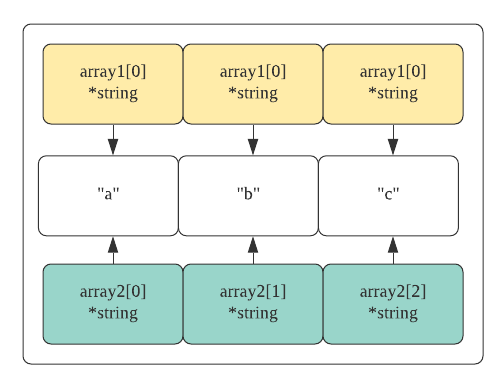

ToC
---
<!-- TOC -->

- [1. Ch 01 About Go](#1-ch-01-about-go)
  - [1.1. advantage](#11-advantage)
  - [1.2. 개발 속도](#12-개발-속도)
  - [1.3. 동시성](#13-동시성)
  - [1.4. 고루틴](#14-고루틴)
  - [1.5. Channel](#15-channel)
  - [1.6. 타입 시스템](#16-타입-시스템)
  - [1.7. 인터페이스](#17-인터페이스)
- [2. CH02 Go Basic](#2-ch02-go-basic)
  - [2.1. 포괄적인 go 철학 & 구조](#21-포괄적인-go-철학--구조)
- [3. CH03 패키징과 내장 도구들](#3-ch03-패키징과-내장-도구들)
  - [3.1. TL;DR](#31-tldr)
  - [3.2. Package](#32-package)
    - [3.2.1. 패키지 기초](#321-패키지-기초)
    - [3.2.2. 패키지의 이름 규칙](#322-패키지의-이름-규칙)
    - [3.2.3. main 패키지](#323-main-패키지)
    - [3.2.4. import](#324-import)
    - [3.2.5. init](#325-init)
    - [3.2.6. Go 내/외장 cmd](#326-go-내외장-cmd)
    - [3.2.7. publis시 주의 사항](#327-publis시-주의-사항)
    - [3.2.8. vendor](#328-vendor)
  - [<br/>](#)
- [CH04 배열, 슬라이스, 맵](#ch04-배열-슬라이스-맵)
  - [TL;DR](#tldr)
  - [배열](#배열)
  - [배열 선언 및 초기화](#배열-선언-및-초기화)
  - [배열 활용](#배열-활용)
  - [다차원 배열](#다차원-배열)
  - [함수에 배열 전달하기](#함수에-배열-전달하기)
  - [슬라이스 내부구조](#슬라이스-내부구조)
  - [슬라이스 생성 및 초기화](#슬라이스-생성-및-초기화)

<!-- /TOC -->

# 1. Ch 01 About Go

## 1.1. advantage
- 빠른 컴파일 타임
- 내장 동시성 라이브러리( 별도의 스레드 lib 없어도 됨)
- 효과적인 타입 시스템(oop 오버헤드 줄임)
- GC

## 1.2. 개발 속도

- 기존의 정적 언어가 컴파일시, 전체 라이브러리의 의존성을 탐색하는 것과 달리, Go 컴파일러는 **직접 참조하는 라이브러리의 의존성만을 해석함**
- 동적 언어들과 비교해서, type safety를 지원(컴파일 에러)

## 1.3. 동시성

- `goroutine`
  - 스레드와 유사하지만 더 적은 메모리 소비, 더 적은 양의 코드로 구현 가능
- `channel`
  - 동기화 기능 내장
  - `typed message`를 활용해 고루틴간의 데이터 공유할 수 있게 하는 **데이터 구조**

## 1.4. 고루틴

Go에서는 여러 개의 고루틴이 하나의 스레드에서 동작합니다. c, java로 웹 서버를 개발하면 여러 request를 동시에 처리하기 위해 스레드를 사용하여야 하지만 (이 때문에 더욱 많은 코드가 추가 되어야 한다.), 반면 GO는 고루틴을 이용해 동시성을 자체적으로 지원하는 `net/http` 라이브러리를 사용합니다. 즉 자동으로 서버로 유입된(inbound) request들은 자동으로 고루틴에서 동작하게 됩니다.

고루틴들은 Go 런타임이 설정한 논리 프로세서 갯수에 따라 자동으로 고루틴 스케줄링을 처리하며, 각각의 논리 프로세서는 하나의 os 스레드에 연결됩니다. (os 스레드는 parallel일 수도, concurrent하게 동작할 수도..? 내가 알기로 window는 thread로 parallel을 관리한다고 들었는데, 이 경우 parallel 가능할 듯)

Q) 고루틴들은 하나의 thread에서 context switching이 일어나는가?
Q) os thread는 PCB가 존재하는가?

## 1.5. Channel
채널은 race condition으로 부터 공유 자원을 보호하기 위한 패턴을 제공합니다. **채널을 통해 어느 한 시점에 하나의 고루틴만이 데이터를 수정할 수 있는 패턴 적용**

`고루틴 -채널-> 고루틴 -채널-> 고루틴`

다음과 같은 flow에 따라서 채널을 통해 데이터 교환이 이뤄지게 함으로 **수정에 대한 순서를 적용가능합니다.**

- 주의 사항
  - 채널이 고루틴 간의 데이터 접근을 보호하지 않고, 데이터 교환에 대한 동기화만 제공함.
  - 즉 채널을 통해 값을 전달한다면, 고루틴들은 안전하게 자신이 필요한 값들을 사용할 수 있지만, 포인터를 교환 후 읽기/쓰기 모두 수행한다면 **여전히 데이터 동기화가 필요**

## 1.6. 타입 시스템
전통적인 상속 기반의 모델을 사용하는 타 언어들과 비교해 Go는 `composition`이라는 디자인 패턴을 활용한 타입 임베드를 제공합니다.

추가로 go 에서는 어떤 타입이 어떤 인터페이스를 구현하고 있다는 것을 선언할 필요가 없이, 동작(행위)자체를 모델링 하는 인터페이스가 존재하여 컴파일러는 현재 사용하고 있는 타입의 값이 사용하고자 하는 인터페이스를 만족하는지를 검사하기만 하면 된다.

## 1.7. 인터페이스
자바와 달리 Go에서 인터페이스는 주로 하나의 동작만을 표현한다.

- `io.Reader`: 우리가 정의하는 타입이 표준 라이브러리의 다른 함수들이 이미 알고 있는 방법으로 데이터를 읽을 수 있다는 것을 간단히 표현 간단히 표현가능

```go
type Reader interface {
    Read(p []byte) (n int, err error)
}
```

<br/>
<br/>
<br/>
<br/>

---

# 2. CH02 Go Basic
- 프로그램 아키텍처
- 타입, 변수, 함수, 메서드 선언
- 고루틴 실행 및 동기화
- 인터페이스를 이용한 범용 코드 작성
- 오류 구현


## 2.1. 포괄적인 go 철학 & 구조
- 최소화된 키워드 집합, 내장 함수, 간결한 문법
- 광범위한 표준 라이브러리 지원


<br/>
<br/>
<br/>
<br/>

---

# 3. CH03 패키징과 내장 도구들

## 3.1. TL;DR

- 패키지는 Go에서 코드를 체계화하는 가장 기본적인 단위
- `GOPATH` 환경 변수에 지정된 경로는 Go 소스 코드가 디스크상에 저장되고, 컴파일 되고 설치되는 경로를 결정하는데 사용
- 3rd lib 의존성들은 `$go get`명령을 이용해 `GOPATH` 환경 변수에 지정된 경로에 다운로드 및 설치 가능


## 3.2. Package
> 모든 go 프로그램은 패키지라고 불리는 일련의 파일 그룹을 통해 관리된다.

### 3.2.1. 패키지 기초
- 모든 .go 파일들은 반드시 공백 및 주석을 제외한 첫 번째 줄에 자신이 속한 패키지의 이름을 선언한다.
- 패키지는 하나의 디렉터리에 저장된다.
- 같은 패키지 이름을 선언하는 모든 .go 파일은 하나의 디렉터리에 저장되어야 한다.

### 3.2.2. 패키지의 이름 규칙
- 패키지의 이름 규칙은 패키지가 저장되는 **디렉터리의 이름을 따르는 것**
- 이렇게 할 경우 패키지를 가져올 때 패키지의 이름을 쉽게 알 수 있다는 장점이 있다.

### 3.2.3. main 패키지
- go cmd를 위한 것으로, **실행 가능한 바이너리 파일로 컴파일 되기 위한 패키지를 정의(바이너리의 1st 진입점)**
- go로 구현한 모든 실행 가능한 프로그램들은 반드시 main 이라는 이름의 패키지를 가지고 있어야 한다.
- main 패키지는 반드시 `main()`함수를 선언해야 한다.

### 3.2.4. import
- import 구문은 컴파일러에게 패키지를 탐색할 디스크상의 경로를 알려준다.
- 표준 라이브러리 내에 구현된 패키지들은 Go가 설치된 경로를 기준으로 탐색한다.
- 직접 작성했거나 표준 패키지가 아닌 경우는 GOPATH 환경 변수에 지정된 경로에 저장된다. (소스 레벨)

```bash
$ go env

...

GOPATH="<사용자ROOT_DIR>/go"
```

- **패키지 이름을 github.com/<유저>/<repo>** 로 두는 이유
  - go build 명령 입장에서 import에 사용되는 경로를 통해 소스 코드들을 `go get`으로 가져오기 때문


### 3.2.5. init
> main()함수가 실행되기 전에 미리 호출되도록 자동 예약되는 함수

```go
package main

import (
    "fmt"
    myfmt "lib/fmt" //alias 가능
    _ "github.cim/minkj1992/dbdriver/postgres" // blank identifier
)
```

간혹 직접 참조할 필요가 없는 패키지를 가져와야 할 경우도 있다. 이 경우 빈 식별자(_)를 활용한다.

> 빈 식별자 (`_`)
>> 패키지를 가져올 때 패키지 이름을 지정하는 경우를 포함해 값의 대입을 건너뛰고 싶은 경우, 함수의 리턴 무시할 경우 사용

```go
import _ <패키지명>
```

다음의 _를 import에서 사용하는 경우를, 자료조사 해보니 크게 2가지로 요약하고 있다.

1. 타 패키지의 init()만을 side-effect로 원할 경우, 즉 실제 사용은 하지 않는다.
   1. 대표적으로 dbdriver가 있다. (`Sqlite.init()`)
2. Call은 하지 않고, 네이밍이 필요한 경우
   1. 예시는 잘 모르겠지만, 개인적으로 생각할 때 exception을 처리할 때, 사용할 것 같다.

Go는 실제로 참조하지 않는 패키지는 가져올 수 없기 때문에, 빈 식별자를 이용해 패키지 이름을 다시 지정하면 컴파일러가 불필요한 패키지 import에 대한 오류를 발생시키지 않고 해당 패키지의 init 함수를 발견하고 호출할 수 있게 해준다.

### 3.2.6. Go 내/외장 cmd

- go clean
  - 소스 repo에 커밋시, 실행 파일이 함께 커밋되지 않도록 함.
- go build
  - 패키지를 빌드
```bash
$ go build
$ go build .
$ go build <파일이름.go>
$ go build github.com/minkj1992/......
```
- go run
  - go build + 바이너리 실행
  - 개인적으로 빌드없이 python 처럼 동적으로 interpret되는줄 알았는데, 아닌 듯 하다.
- go vet
  - 코드상에서 일반적으로 발생할 수 있는 에러를 검사
- go fmt
  - 소스코드의 파일 형식을 재조정한 뒤 다시 저장한다.
- go doc <패키지명>
  - 터미널 상에서 doc가 보인다.
- godoc 포트
  - godoc -http=:6060
  - 웹상에서 doc 열람
  - 이런 doc를 만들고 싶다면(자동), **함수 바로 위에 주석을 작성, /**/ 하면 된다.**
  - 또는 `doc.go`를 패키지에 추가한 후 패키지를 선언하기 전에 주석으로 패키지에 대한 문서 작성하면 된다.

### 3.2.7. publis시 주의 사항
> 부제: 다른  Go 개발자와 협업하기

- 패키지는 반드시 저장소의 루트에 저장해야 한다.
  - 즉 github에 repo 생성시, **반드시 패키지 이름을 저장소 이름으로 사용해야 한다.**
- 패키지의 크기는 최대한 작게 유지
  - 패키지가 너무 적은 수의 API, 하나의 작업만을 수행한다 해도 염려할 필요없다. 

### 3.2.8. vendor
> 의존성 문제 해결을 위한 벤더링, 경로 재작성(import path rewriting)

- **go mod와의 관계를 잘 모르겠으므로 대충 정리합니다.**

사용하는 모든 의존성을 프로젝트 repo 디렉토리에 복사한 후, 이 의존성들을 참조하는 import path를 프로젝트가 제공하는 경로로 다시 작성하는 방식

> 즉, 링킹할 모든 소스코드 의존성들 다 copy한다음에, 프로젝트 이름으로 import 재작성하는 방식이라는 뜻

<br/>
<br/>
<br/>
<br/>
---


# CH04 배열, 슬라이스, 맵
> collection

## TL;DR

- 배열은 슬라이스와 맵의 내부적인 구현을 위한 블록 역활을 담당한다.
- `make()` 내장 함수를 사용하면 슬라이스/맵의 초기화 시점에 len, cap을 지정하여 생성 가능하다.
- 슬라이스/ 맵의 리터럴(:=)을 사용하면 선언 신점에 초깃값을 세팅 가능하다.
- 슬라이스는 용량의 제한을 가지지만, append를 활용해 확장가능하다.
- cap 내장 함수는 슬라이스에 대해서만 호출 가능하다(map 불가능)
- 함수에 슬라이스/ 맵을 전달하는 작업은 포인터 값(ref)만 전달하므로 자원 활용에 대한 비용 측면에서 이점이 있다.

## 배열

- 각 요소는 동일한 타입의 값을 가짐
- 메모리에 연속적으로 할당
  - 이로 인하여 CPU 캐시에 보다 오래 보관
  - 배열 원소 간의 이동이 빠르게 진행

## 배열 선언 및 초기화
- 배열을 제로 값으로 초기화하여 선언
  - 타입에 따라서 상응하는 제로 값으로 초기화 된다.
```go
var array [5]int
```

- 배열 선언 및 초기화(array literal)
```go
array := [5]int {10,20,30,40,50}
```

- 자동으로 길이 조절 배열 선언
  - 길이를 `[...]`으로 설정하면 초기화 되는 원소의 갯수를 토대로 배열 길이가 자동 지정
```go
array := [...]int{10,20,30,40,50}
```

- 원소의 일부만 초기화 (배열 길이를 알고 있을 경우)
```go
array := [5]int{1:10,2:20}
```

## 배열 활용
- 원소 접근
```go
array[2] = 35
```

- 원소 포인터 요소 접근
```go
// int 포인터 배열 선언
package main

import "fmt"

func main() {
	array := [5]*int{0: new(int), 1: new(int)}
	*array[0] = 10
	*array[1] = 20
	fmt.Println(*array[0], *array[1]) // 10 20
	fmt.Println(array)                // [0xc0000b4008 0xc0000b4010 <nil> <nil> <nil>]

}
```

go에서는 배열은 값으로 취급된다. 이는 배열을 대입 연산자와 함께 사용할 수 있다는 것을 의미한다.

> 참고로 python의 경우 모든 타입은 ref(object)로 처리되어 copy시 ref copy된다. 


- 배열 대입(assign)
```go
var array1 [3]string

array2 := [3]string{"a", "b", "c"}

array1 = array2 // 서로 Type과 len이 같다면 okay
```


- 포인터 배열 대입(assign)
```go
var array1 [3]*string
array2 := [3]*string{new(string), new(string), new(string)}

*array2[0] = "a"
*array2[1] = "b"
*array2[2] = "c"

array1 = array2
```

**포인터의 배열을 복사하면 포인터가 가리키는 주소의 값({"a","b","c"})이 아니라 포인터 값 자체(주솟값)가 복사된다.**



## 다차원 배열

- 2차원 배열 선언
```go
var array [4][2]int

array := [4][2]int{{1,2},{1,2},{1,2},{1,2}}

// 일부분만 선언
array := [4][2]int{1:{1,2}, 3:{1,2}}
```

## 함수에 배열 전달하기

함수 간에 변수를 전달할 때는 항상 그 값이 전달된다. 이는 메모리와 성능 면에서 높은 비용이 소모되는 작업이다.

> 파이썬은 list 포함 모든 함수 인자 전달은 Call by Object Reference이다. 쉽게 말해 immutable에 대해서는 call by value, mutable에 대해서는 call by ref. 
>> 참고로 파이썬에서는 모든 값들 또한 object(싱글톤)이며, 이를 대입하는 변수는 해당 object를 가리키는 ref (object ref)이다. 함수 전달에서 파이썬은 이 값을 전달.

- 함수에 커다란 배열 값으로 전달
```go
func foo(array [1e6]int){
  //
}

var array [1e6]int

foo(array)
```

이 경우 효과적인 전달 방법은 배열 포인터를 전달하는 것이다.

```go
func foo(array *[1e6]int){

}

var array [1e6]int

foo(&array)
```

다음과 같은 경우에 주의사항은, 포인터를 전달하기 때문에 함수 내부에서 값을 변경하면, 변경된 값이 외부와 공유된다는 점이다. (**슬라이스가 이와 같은 문제를 해결할 수 있다.**)

## 슬라이스 내부구조

슬라이스는 쉽게 말해 동적 배열이다. 배열과 마찬가지로 메모리가 연속적인 블록으로 할당된다.


- 실제 슬라이스는 1)내부 array 포인터, 2) len int 변수, 3) cap int 변수로 구성된 가벼운 구조체이다.

- 슬라이스에는 두가지 타입이 존재한다.
  1. 원본 슬라이스
  2. 복사 슬라이스
- 이 둘은 하나의 `내부-array`를 공유한다.
- 만약 내부 array를 분리하고 싶다면 len과 cap을 같도록 설정하면 가능하다.
  - ex) `newSlice := slice[5:10:10] // [start_index, len, cap]`

## 슬라이스 생성 및 초기화

- make 함수 (길이 명시)
```go
slice := make([]string, 5)

fmt.Println(slice[1] == "") // true
fmt.Println(len(slice), cap(slice)) // 5 5
```

- len, cap 명시
```go
slice := make([]string, 3, 5)
fmt.Println(len(slice), cap(slice)) // 3 5
```

